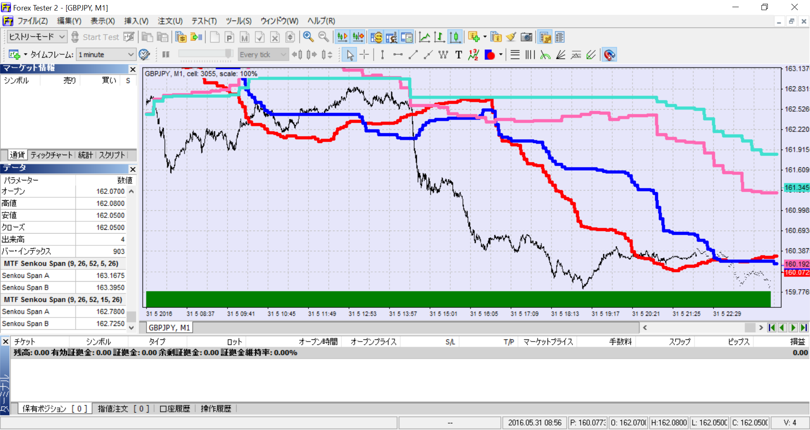

# WL_MTF_SenkouSpan
マルチタイムフレーム先行スパン インジケータ
Forex Tester 2 用

## 概要
一目均衡表から先行スパンを抜き出し、マルチタイムフレーム対応したものになります。

## 動作環境
Forex Tester 2 

## ビルド
ビルドのためには、Forex Tester 2 付属の以下のファイルが必要になります。

* TechnicalFunctions.h
* IndicatorInterfaceUnit.h

# スクリーンショット
 